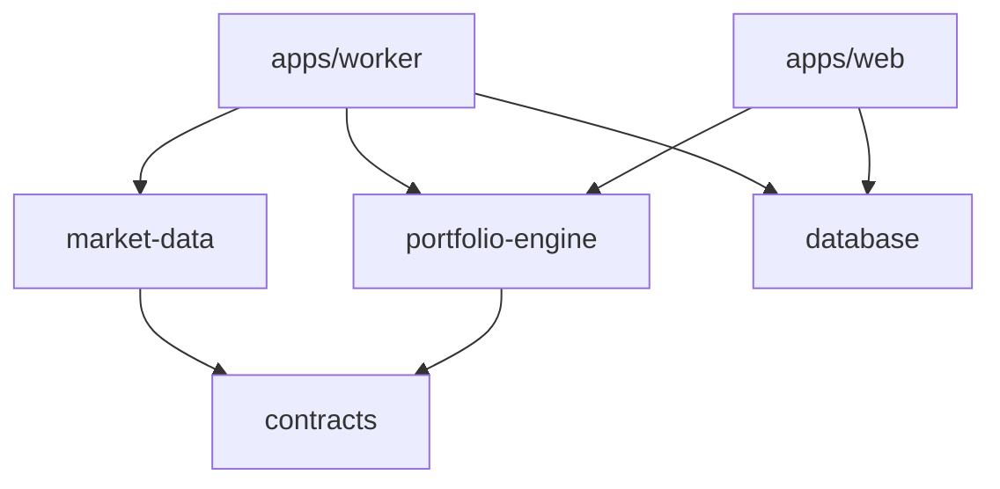

# Structure initiale du projet

## Arborescence

```text
bvc-portfolio/
├── apps/
│   ├── web/
│   │   ├── app/
│   │   │   ├── [locale]/
│   │   │   │   ├── (auth)/
│   │   │   │   ├── (dashboard)/
│   │   │   │   └── admin/
│   │   │   └── api/
│   │   ├── components/
│   │   ├── features/
│   │   ├── lib/
│   │   │   ├── auth/
│   │   │   ├── dal/
│   │   │   ├── i18n/
│   │   │   └── validation/
│   │   ├── messages/
│   │   │   ├── fr.json
│   │   │   └── ar.json
│   │   └── tests/
│   └── worker/
│       ├── src/
│       │   ├── consumers/
│       │   ├── ingestion/
│       │   ├── recalculation/
│       │   ├── notifications/
│       │   └── observability/
│       └── tests/
├── packages/
│   ├── portfolio-engine/
│   │   ├── src/
│   │   │   ├── ledger/
│   │   │   ├── positions/
│   │   │   ├── performance/
│   │   │   ├── risk/
│   │   │   └── money/
│   │   └── tests/
│   │       └── fixtures/golden/
│   ├── market-data/
│   │   ├── src/contracts/
│   │   ├── src/providers/mock/
│   │   ├── src/normalization/
│   │   └── src/validation/
│   ├── database/
│   │   ├── src/queries/
│   │   └── src/types/
│   ├── contracts/
│   ├── ui/
│   ├── i18n/
│   └── observability/
├── supabase/
│   ├── migrations/
│   ├── seed.sql
│   └── tests/
│       ├── rls/
│       └── invariants/
├── docs/
│   ├── adr/
│   ├── calculations/
│   ├── runbooks/
│   └── data-contracts/
├── e2e/
├── scripts/
├── .github/workflows/
├── .env.example
├── package.json
├── pnpm-workspace.yaml
└── turbo.json
```

## Règles de dépendance



- `portfolio-engine` ne dépend d’aucune application ni infrastructure.
- `market-data` dépend de contrats internes, jamais du modèle UI.
- `database` ne contient aucune règle financière ; il persiste les résultats du domaine.
- `web` ne contacte jamais directement le fournisseur BVC.
- `ui` ne reçoit que des DTO prêts à afficher.

## Conventions

- TypeScript strict partout.
- Noms de fichiers et code en anglais ; interface traduite en français/arabe.
- Une migration SQL par changement de schéma, jamais de modification rétroactive d’une migration appliquée.
- Une règle financière nouvelle exige : ADR, version de calcul, golden fixture et test de non-régression.
- Toute mutation exige une clé d’idempotence et un événement d’audit.
- Les `service_role`/secrets ne sont importables que depuis des modules marqués serveur.
- Les tests de RLS s’exécutent contre une vraie base PostgreSQL locale.

## Première tranche verticale

La première PR fonctionnelle doit couvrir uniquement :

1. inscription et session ;
2. création d’un portefeuille MAD ;
3. dépôt de trésorerie ;
4. achat d’un titre synthétique ;
5. calcul quantité/coût moyen/trésorerie ;
6. ajout d’un cours synthétique ;
7. snapshot journalier ;
8. affichage valeur et gain latent ;
9. isolation RLS entre deux utilisateurs ;
10. test golden du résultat.

Cette tranche valide l’architecture avant d’ajouter ventes, dividendes, TWR, XIRR et données BVC réelles.

## Branches et qualité

- Branche protégée `main` ; PR obligatoire.
- Vérifications : format, lint, TypeScript, unitaires, intégration DB, RLS, build et E2E critique.
- Migrations testées depuis une base vide et depuis le dernier snapshot de staging.
- Aucun secret, export de production ou donnée personnelle dans Git.
- Conventional Commits recommandés : `feat:`, `fix:`, `test:`, `docs:`, `chore:`.

## Variables d’environnement attendues

```text
NEXT_PUBLIC_APP_URL=
NEXT_PUBLIC_SUPABASE_URL=
NEXT_PUBLIC_SUPABASE_PUBLISHABLE_KEY=
SUPABASE_SERVICE_ROLE_KEY=
DATABASE_URL=
WORKER_DATABASE_URL=
MARKET_DATA_PROVIDER=
MARKET_DATA_API_URL=
MARKET_DATA_API_KEY=
INTERNAL_JOB_SIGNING_SECRET=
ERROR_TRACKING_DSN=
EMAIL_PROVIDER_API_KEY=
```

Le démarrage doit échouer explicitement si une variable serveur obligatoire manque. Les valeurs réelles ne doivent jamais être écrites dans `.env.example`.
