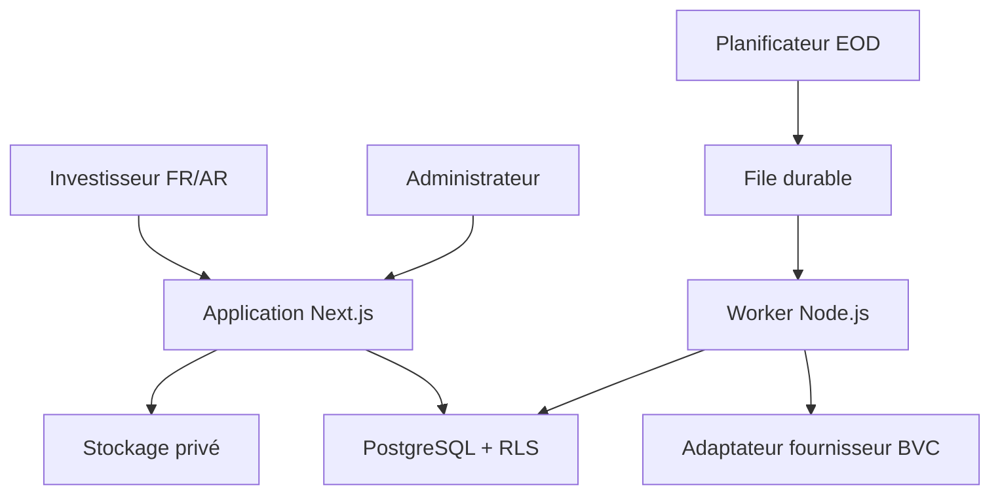
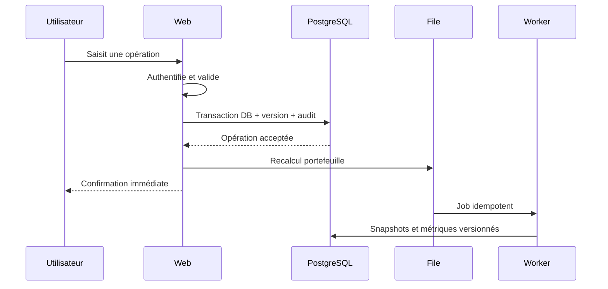
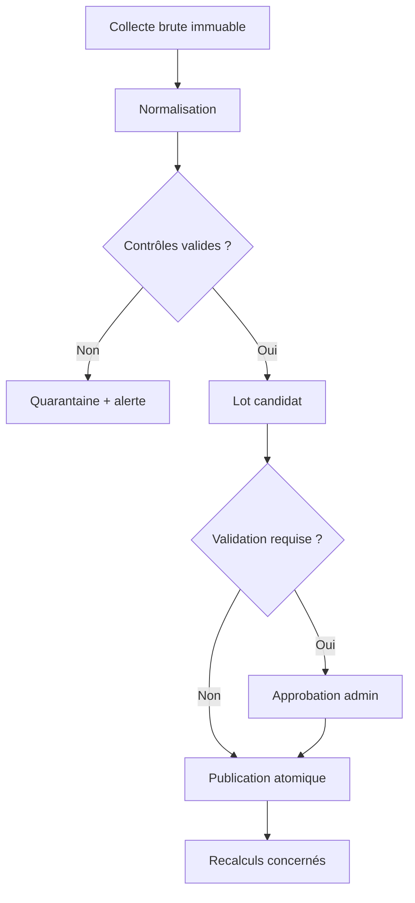

# Architecture technique — MVP de suivi de portefeuilles BVC

## 1. Décision d’architecture

L’architecture recommandée est un **monolithe modulaire accompagné d’un worker**, et non un ensemble de microservices.

- Le monolithe réduit le temps de livraison, les coûts d’exploitation et les risques de cohérence.
- Le worker sépare les traitements longs et relançables : ingestion EOD, valorisation, recalculs et notifications.
- Les frontières de modules sont explicites afin de pouvoir extraire un service plus tard sans réécrire le domaine.
- PostgreSQL est la source de vérité ; aucun calcul financier définitif ne dépend d’un cache.

## 2. Stack retenue

| Couche | Choix MVP | Justification |
|---|---|---|
| Interface web | Next.js App Router, React, TypeScript | SSR, formulaires serveur, internationalisation et déploiement géré ou auto-hébergé |
| Design system | Tailwind CSS + composants accessibles de type shadcn/ui | Rapidité et contrôle visuel sans dépendance propriétaire forte |
| Base de données | PostgreSQL via Supabase au lancement | Transactions, types `numeric`, RLS, Auth, Storage, Cron et files persistantes |
| Accès aux données | SQL migrations comme référence + Drizzle pour les requêtes typées | Schéma auditable, requêtes explicites et portabilité PostgreSQL |
| Authentification | Supabase Auth | Réduit le délai de mise en œuvre ; autorisation toujours vérifiée côté serveur et par RLS |
| Stockage fichiers | Supabase Storage | Pièces des dossiers support ; accès privé par URL signée courte |
| Worker | Node.js TypeScript dans un conteneur séparé | Pas de limite courte de fonction pour les recalculs et portabilité vers VPS |
| File de tâches | PGMQ/Supabase Queues | Durable, proche de la donnée et sans Redis au MVP |
| Planification | `pg_cron` déclenchant des messages de file | Horaire contrôlé, historique des exécutions et reprise |
| Validation | Zod aux frontières HTTP, fournisseur et variables d’environnement | Rejet précoce des entrées invalides |
| Calculs décimaux | `numeric` PostgreSQL + bibliothèque décimale côté TypeScript | Aucun montant en flottant binaire |
| Tests | Vitest, tests PostgreSQL, Playwright | Unitaires financiers, intégration/RLS et parcours navigateur |
| Observabilité | Logs structurés + suivi d’erreurs + métriques métier | Distingue incidents techniques et qualité des données |
| CI/CD | GitHub Actions | lint, types, tests, migration dry-run et build sur chaque PR |

### Portabilité

Le web peut être déployé sur Vercel ou en conteneur Node. Le worker est toujours conteneurisé. Les fonctionnalités Supabase sont encapsulées derrière des ports internes : identité, stockage, file et planification. Une migration future vers un VPS PostgreSQL reste possible sans modifier le moteur financier.

## 3. Vue des composants



## 4. Modules métier

| Module | Responsabilité | Interdiction |
|---|---|---|
| Identity | session, profil, rôle, langue | ne décide pas de la propriété d’une ressource sans DB/RLS |
| Portfolio | portefeuilles et droits de propriétaire | ne calcule pas les cours |
| Transactions | validation et versionnement des opérations | aucune suppression silencieuse |
| Ledger | écritures de trésorerie déterministes | ne lit pas l’interface |
| Positions | quantité, coût moyen, gains réalisés | aucun accès direct au fournisseur BVC |
| Market Data | instruments, cours, benchmark, opérations sur titres | ne publie pas un lot non validé |
| Performance | TWR, XIRR, décomposition du rendement | aucun `number` pour les montants |
| Risk | concentration, volatilité, drawdown, corrélation | ne produit pas de recommandation personnalisée |
| Notifications | avis, prise de connaissance | ne modifie pas un recalcul |
| Support | dossiers de contestation et pièces | ne corrige pas le marché directement |
| Audit | événements immuables et versions | aucune mise à jour destructive |

## 5. Principes du moteur financier

Le paquet `portfolio-engine` est une bibliothèque TypeScript pure :

- aucune dépendance à Next.js, Supabase ou au fournisseur de cours ;
- entrées et sorties sérialisables ;
- calculs déterministes et versionnés (`calculation_rule_version`) ;
- fonctions sans effet de bord pour ledger, positions, TWR et risque ;
- arrondis uniquement aux frontières d’affichage ou selon une règle métier explicite ;
- jeux de référence indépendants conservés dans `fixtures/golden`.

Les montants sont transmis sous forme de chaînes décimales. Les dates de marché sont des dates civiles `YYYY-MM-DD`, distinctes des horodatages UTC. La journée métier et les heures de coupure utilisent `Africa/Casablanca`.

## 6. Flux principal d’une opération utilisateur



### Cohérence

- L’écriture de l’opération, du journal de trésorerie, de l’événement d’audit et du message de recalcul doit être atomique ou utiliser un **transactional outbox**.
- Une clé d’idempotence est obligatoire pour toute mutation et tout job.
- Une modification produit une nouvelle version. Une annulation ajoute une contre-écriture ; elle ne supprime pas l’historique.
- Les mises à jour sensibles utilisent une transaction `serializable` ou un verrou ciblé afin d’éviter deux recalculs concurrents incompatibles.

## 7. Pipeline BVC de fin de journée



### Étapes et statuts

`scheduled → collecting → normalized → validating → quarantined | approved → published → recalculating → completed | failed`

### Contrat de l’adaptateur fournisseur

```ts
interface MarketDataProvider {
  providerId: string;
  fetchDailyPrices(marketDate: string): Promise<RawPriceBatch>;
  fetchSecurityMaster(): Promise<RawSecurity[]>;
  fetchCorporateActions(from: string, to: string): Promise<RawCorporateAction[]>;
  fetchBenchmark(from: string, to: string): Promise<RawBenchmarkPoint[]>;
}
```

L’adaptateur ne peut écrire que dans la zone brute. La normalisation et la publication appartiennent au domaine interne.

### Contrôles bloquants

- identifiant ou date non reconnus ;
- prix nul/négatif/non numérique ;
- doublon instrument/date dans le même lot ;
- date future ;
- empreinte déjà ingérée avec contenu incohérent ;
- couverture inférieure au seuil attendu sans justification de suspension ;
- variation anormale non expliquée par une opération sur titres.

Le dernier prix publié reste actif tant qu’un nouveau lot n’est pas validé.

## 8. Modèle de données physique

### Schémas PostgreSQL

- `public` : tables exposables sous RLS ; profils, portefeuilles, opérations, notifications et dossiers support.
- `market` : instruments, identifiants, lots, cours, benchmark et opérations sur titres.
- `analytics` : snapshots, métriques et versions de calcul.
- `private` : fonctions de rôle, outbox, paramètres sensibles et vues internes.
- `audit` : événements append-only et historique des corrections.

### Règles de type

- PK : UUID.
- Sommes/prix : `numeric(20,6)` ; quantité : `numeric(24,8)`.
- Rendements : `numeric(20,10)`.
- Date de marché : `date`.
- Horodatage technique : `timestamptz` en UTC.
- État : `text` + contraintes `check`, afin d’éviter des migrations d’enum difficiles.
- Payload fournisseur : `jsonb` dans une table brute avec empreinte SHA-256.

### Index critiques

- `transactions(portfolio_id, trade_date, created_at)` ;
- `market.prices(security_id, market_date desc)` unique ;
- `analytics.portfolio_snapshots(portfolio_id, valuation_date desc)` unique par version ;
- `notifications(user_id, acknowledged_at, created_at desc)` ;
- `audit.events(entity_type, entity_id, created_at desc)` ;
- index partiel des jobs/anomalies non résolus.

## 9. API et Data Access Layer

Les pages serveur et Server Actions appellent une couche d’accès aux données dédiée. Toute action est considérée comme un point d’entrée public :

1. authentifier ;
2. valider l’entrée ;
3. charger la ressource et vérifier propriétaire/rôle ;
4. exécuter la transaction ;
5. journaliser ;
6. retourner un DTO minimal.

Endpoints internes prévus :

- `POST /api/portfolios/:id/transactions` ;
- `POST /api/portfolios/:id/recalculate` (administratif/interne) ;
- `POST /api/internal/market-data/runs` ;
- `POST /api/internal/jobs/consume` ;
- `POST /api/recalculations/:id/acknowledge` ;
- `POST /api/recalculations/:id/issues`.

Les endpoints internes exigent une identité de service, une signature, une durée de validité et une protection contre le rejeu.

## 10. Autorisation et RLS

Matrice minimale :

| Ressource | Investisseur | Admin support | Admin données |
|---|---|---|---|
| Son portefeuille | lecture/écriture | accès limité au dossier lié | accès technique minimisé |
| Portefeuille tiers | aucun | uniquement sur dossier attribué | uniquement si nécessaire au recalcul |
| Données de marché publiées | lecture | lecture | gestion |
| Lot brut/quarantaine | aucun | aucun | gestion |
| Dossier support | propriétaire | gestion attribuée | lecture si lié aux données |
| Audit | extraits liés à l’utilisateur | lecture limitée | lecture complète nécessaire |

Principes :

- RLS activée sur toute table accessible via l’API de données.
- Les tables `market`, `analytics`, `private` et `audit` ne sont pas exposées directement au navigateur.
- La clé de service n’existe que dans le worker et l’environnement serveur.
- Une fonction `private.has_role(role)` évite les politiques récursives.
- Les tests d’autorisation couvrent chaque couple rôle/opération et les références UUID devinées.

## 11. Internationalisation et accessibilité

- Routes localisées : `/fr/...` et `/ar/...` ; anglais préparé, non activé au lancement.
- Clés de traduction centralisées ; aucune chaîne fonctionnelle codée en dur.
- Courriels, erreurs, validations, exports et administration passent aussi par i18n.
- RTL défini au niveau du document et testé par capture visuelle.
- Les graphiques disposent d’un tableau ou résumé textuel équivalent.
- Les valeurs provisoires utilisent texte + icône + explication, jamais la couleur seule.

## 12. Cache et performance

- Les données privées de portefeuille ne passent jamais dans un cache public partagé.
- Les pages sociétés et cours publiés peuvent être mises en cache avec invalidation après publication d’un lot.
- Le tableau de bord lit les derniers snapshots au lieu de recalculer toute l’histoire à chaque requête.
- Une saisie d’opération donne une confirmation immédiate et affiche « recalcul en cours » jusqu’au nouveau snapshot.
- Objectif P95 après cache : tableau de bord ≤ 2,5 s ; mutation utilisateur ≤ 800 ms hors job asynchrone.

## 13. Observabilité

Chaque log structuré comporte `request_id`, `user_id` pseudonymisé si nécessaire, `portfolio_id`, `job_id`, `ingestion_run_id`, version de règles et résultat.

Métriques métier :

- heure du dernier lot BVC publié ;
- couverture des instruments actifs ;
- nombre d’anomalies et âge de la plus ancienne ;
- profondeur de la file et nombre de retries ;
- durée et taux d’échec des recalculs ;
- nombre de portefeuilles utilisant un prix provisoire ;
- écart entre snapshots et contrôles de conservation.

Alertes P0 : fuite d’autorisation détectée, lot invalide publié, double écriture financière, sauvegarde échouée, absence de cours après le délai convenu.

## 14. Environnements et déploiement

| Environnement | Données | Usage |
|---|---|---|
| Local | synthétiques uniquement | développement et tests |
| Preview | synthétiques/anonymisées | PR et validation UI |
| Staging | jeu licencié limité | répétition des migrations et ingestion |
| Production | données réelles | utilisateurs publics |

Le déploiement production exige : migration testée, build vert, tests financiers golden, tests RLS, sauvegarde récente, plan de retour arrière et approbation manuelle.

Le schéma suit des migrations ascendantes compatibles : ajout de colonnes nullable, backfill, bascule de lecture, puis contrainte. Une migration destructive nécessite une sauvegarde vérifiée et une fenêtre dédiée.

## 15. Sauvegarde et continuité

- sauvegarde PostgreSQL quotidienne et récupération point-in-time selon l’offre ;
- sauvegarde séparée des pièces jointes ;
- test de restauration trimestriel au minimum ;
- objectif initial RPO ≤ 24 h et RTO ≤ 8 h ;
- export vérifiable des opérations utilisateur ;
- procédure écrite pour compromission, panne fournisseur et corruption de cours.

## 16. Décisions ADR à conserver

1. Monolithe modulaire + worker, pas de microservices au MVP.
2. PostgreSQL comme source de vérité.
3. Moteur financier TypeScript pur et versionné.
4. PGMQ plutôt que Redis au lancement.
5. Snapshots pour la lecture ; ledger et événements comme preuves.
6. Adaptateur fournisseur remplaçable.
7. Hébergement managé pour accélérer le lancement, avec voie documentée vers conteneurs/VPS.
8. Aucune donnée BVC de production sans droits explicites.

## 17. Risques techniques et réponses

| Risque | Réponse |
|---|---|
| Fournisseur BVC indisponible | adaptateur, CSV administrateur audité, dernier lot valide conservé |
| Recalcul trop long | lots paginés, file durable, reprise par checkpoint, worker horizontal |
| Divergence ledger/snapshot | contrôles de conservation quotidiens et reconstruction possible |
| Erreur de formule | version de règles, golden tests, double validation indépendante |
| Fuite inter-utilisateurs | DAL serveur + RLS + matrice de tests négatifs |
| Verrouillage Supabase | SQL standard, worker conteneurisé, ports d’infrastructure |
| Coût imprévu | métriques d’usage, limites, stockage brut avec politique de conservation |
| Données transfrontalières | revue CNDP avant production et option d’hébergement PostgreSQL au Maroc |

## 18. Sources techniques officielles vérifiées

- Next.js peut être déployé comme serveur Node ou conteneur : https://nextjs.org/docs/app/getting-started/deploying
- Les Server Actions doivent être authentifiées et autorisées comme des endpoints publics : https://nextjs.org/docs/app/guides/data-security
- Supabase RLS fournit une protection au niveau des lignes : https://supabase.com/docs/guides/database/postgres/row-level-security
- Supabase Queues repose sur une file durable PostgreSQL/PGMQ : https://supabase.com/docs/guides/queues
- Supabase Cron planifie les traitements récurrents : https://supabase.com/docs/guides/cron
- Les fonctions Edge ont des limites de CPU, mémoire et durée ; elles ne sont pas le moteur principal de recalcul : https://supabase.com/docs/guides/functions/limits
- PostgreSQL documente l’isolation transactionnelle, dont `serializable` : https://www.postgresql.org/docs/current/transaction-iso.html

## 19. Décisions restant réellement bloquantes

Le codage avec données synthétiques peut commencer immédiatement. Seuls les éléments suivants bloquent la production publique :

- contrat du fournisseur BVC et droits de redistribution ;
- disponibilité/licence MASI Total Return ;
- région et régime d’hébergement au regard de la CNDP ;
- nom commercial, domaine et identité ;
- entité exploitante, conditions et avertissements ;
- politique tarifaire avant ouverture des abonnements.
